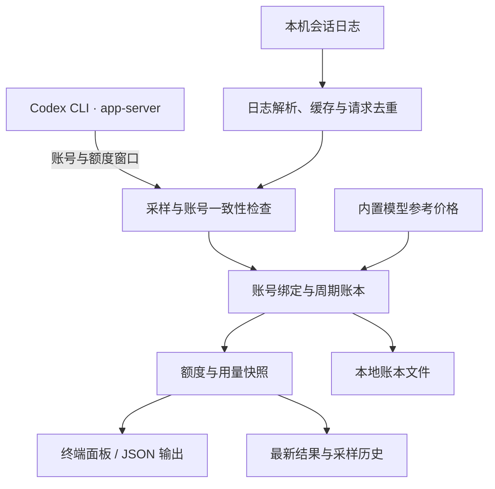

<div align="center">

# Codex Quota Monitor

**在终端里看清 Codex 额度、重置时间与本机用量。**

[](https://nodejs.org/en)

[](LICENSE)

[快速开始](#快速开始) · [使用指南](#使用指南) · [工作原理](#工作原理) · [常见问题](#常见问题) · [参与贡献](#参与贡献) · [致谢](#致谢)

</div>

Codex Quota Monitor 是一个面向 Windows 的本地终端工具。它通过已登录的 Codex CLI 查询账号额度，结合本机会话日志，按**当前账号、当前额度周期**汇总请求、Token 和 API 等值金额。

适合希望随时查看「还剩多少额度、什么时候重置、这个周期用了多少」的 Codex 用户。终端界面为中文，支持持续监控、单次查询和 JSON 输出。

> 社区独立项目，与 OpenAI 无隶属关系。额度百分比来自 Codex 接口；美元金额是根据本机日志计算的 API 等值估算，不代表实际账单或可用现金余额。

## 功能概览

| 能力 | 说明 |
| --- | --- |
| 额度窗口 | 展示接口返回的 5 小时、周限额及其他额度窗口，包含剩余比例、重置时间和倒计时 |
| 周期用量 | 按账号与窗口汇总本机请求和 Token；`--details` 展开各模型的输入、缓存与输出明细 |
| 金额估算 | 使用内置参考价格计算 API 等值；满足历史完整性等条件后，外推满额与剩余等值 |
| 终端交互 | 默认每 60 秒刷新，支持快捷键刷新、扫描进度和中途退出 |
| 本地账本 | 保存采样与请求元数据，处理重复日志、账号切换和周期重置 |
| 脚本集成 | 单次输出 JSON；持续监控时每行输出一份独立 JSON 快照 |

## 快速开始

### 环境要求

| 项目 | 要求 |
| --- | --- |
| 操作系统 | Windows x64 或 ARM64 |
| 运行时 | [Node.js](https://nodejs.org/en) 22 或更高版本，包含 npm |
| Codex CLI | 已安装，并使用 ChatGPT 订阅账号登录 |
| 获取源码 | Git，或从 GitHub 下载并解压源码 |

尚未配置 Codex CLI 时，请先按 [官方项目说明](https://github.com/openai/codex#quickstart) 完成安装与登录。仅使用 API Key 的登录方式不适用于本工具的订阅额度查询。

### 安装并启动

在 PowerShell 中执行：

```powershell
git clone https://github.com/AuroraWhisperer/codex-quota-monitor.git
cd codex-quota-monitor
npm ci
npm start
```

启动后会依次显示额度查询、日志筛选和统计进度，随后进入自动刷新的监控面板。完成安装后，也可以双击仓库中的 [`start-monitor.cmd`](start-monitor.cmd) 启动。

按 **`1`、`R`（大小写均可）或 `Enter`** 立即刷新，按 **`Ctrl+C`** 退出。快捷键仅在交互式终端的持续监控文本模式下生效。

## 使用指南

### 常用命令

| 场景 | 命令 |
| --- | --- |
| 持续监控 | `npm start` |
| 查询一次并退出 | `npm run snapshot` |
| 查看完整额度与逐模型明细 | `npm run snapshot -- --details` |
| 输出单次 JSON 快照 | `npm run --silent snapshot -- --json` |
| 持续输出 JSON 快照 | `npm run --silent start -- --json` |
| 将刷新间隔设为 120 秒 | `npm start -- --interval 120` |
| 查看命令行帮助 | `npm run snapshot -- --help` |

`--interval` 的单位为秒，允许范围为 **30–3600**，默认 **60**。JSON 模式建议搭配 npm 的 `--silent`，避免 npm 自身的启动提示混入输出。

交互式面板每轮刷新会清除上一轮画面及回滚历史；单次查询和重定向输出保留纯文本。正在采样时连续按刷新键，最多排队一次后续刷新。

### 配置

| 环境变量 | 默认行为 | 用途 |
| --- | --- | --- |
| `CODEX_BIN` | 从 `PATH` 及常见 npm 安装位置查找 | 指定原生 `codex.exe` 的完整路径 |
| `CODEX_HOME` | `%USERPROFILE%\.codex` | 指定 Codex CLI 的账号配置与日志目录 |

例如，自动发现失败时，可以在当前 PowerShell 会话中指定程序路径，再启动监控：

```powershell
$env:CODEX_BIN = 'C:\path\to\codex.exe'
npm start
```

请将示例路径替换为实际路径。`CODEX_BIN` 应指向原生可执行文件；npm 生成的 `codex.cmd` 不是该配置项所需的文件。

每份账本绑定首次使用的 `CODEX_HOME`。已有账本时切换到其他日志目录，程序会停止并提示目录不匹配；需要监控另一个目录时，可使用独立的项目副本保存其账本。

## 工作原理

额度查询与本机日志统计分别提供数据，再由周期账本汇总为一份快照。



### 统计口径

- **额度**：通过 Codex CLI 的 `account/read` 和 `account/rateLimits/read` 获取；不同额度桶分别展示，缺失窗口显示「接口未返回」。
- **周期**：以接口给出的窗口时长和重置时间为准。周期起点等于重置时间减去窗口时长，周窗口不按自然周计算。
- **用量**：读取 `CODEX_HOME` 下的 `sessions/` 与 `archived_sessions/`，按请求去重，再归入对应账号和周期。
- **账号归属**：首次识别的账号从首次观测时开始绑定。日志不具备可靠的逐请求账号标识，因此更早的历史不会自动归入新账号。

### 如何理解金额

已用 API 等值来自逐请求模型、Token 分类和已记录的速度档位。价格与长上下文调整规则保存在 [`src/usage-pricing.mjs`](src/usage-pricing.mjs)，不会自动联网更新；未知模型显示「待定价」，速度档位不明时保留金额范围。

只有在账号历史覆盖当前周期、额度已用比例大于零，且定价与日志等检查通过时，才会进行以下外推：

```text
满额 API 等值 ≈ 本周期已用 API 等值 × 100 ÷ 额度已用百分比
剩余 API 等值 ≈ 满额 API 等值 × 剩余百分比 ÷ 100
```

其他设备的用量、缺失日志、接口上报延迟和模型组合变化都会影响结果。周期内出现额度比例回退、额外 credits 变化或重置券减少时，程序保留本机累计用量，并暂停受影响周期的外推。额外 credits 和重置券独立展示。

## 数据与隐私

运行数据保存在**项目目录下的 `data/`**，不随启动终端的工作目录变化。

| 文件 | 内容 |
| --- | --- |
| `data/ledger.json` | 账号绑定、去重请求元数据与周期汇总，采用临时文件替换方式保存 |
| `data/latest.json` | 最近一次采样的完整结果 |
| `data/samples.jsonl` | 按行追加的历史采样 |
| `data/monitor.lock` | 运行期间的进程锁，避免多个实例同时写入 |

监控读取本地账号配置和会话日志，持久化用量元数据，不将对话正文、邮箱、凭据或原始账号 ID 写入上述记录。账号与请求标识使用 SHA-256 指纹。

额度查询由本机 Codex CLI 连接其服务完成；本工具没有独立的数据上传服务。`data/`、`node_modules/` 和开发归档 `tmp/` 已由 [`.gitignore`](.gitignore) 排除。反馈问题时，请检查并脱敏附带的日志与截图。

## 项目结构

项目采用 Node.js 原生 ES Modules。运行代码使用内置模块，`@xterm/headless` 用于开发测试中的终端行为验证。

| 路径 | 职责 |
| --- | --- |
| [`src/quota-monitor.mjs`](src/quota-monitor.mjs) | 命令行入口、进程锁、持久化调度与刷新循环 |
| [`src/quota-terminal.mjs`](src/quota-terminal.mjs) | 报告格式、终端输出与按键刷新 |
| [`src/quota-collector.mjs`](src/quota-collector.mjs) | 单轮采样、账号一致性检查与日志扫描进度 |
| [`src/quota-sources.mjs`](src/quota-sources.mjs) | Codex 程序发现、账号上下文与额度查询 |
| [`src/quota-ledger.mjs`](src/quota-ledger.mjs) | 账号历史绑定、周期汇总、估算与账本存储 |
| [`src/usage-logs.mjs`](src/usage-logs.mjs) | 会话发现、日志解析、扫描缓存与请求去重 |
| [`src/usage-pricing.mjs`](src/usage-pricing.mjs) | 模型参考价格、速度档位与长上下文调整 |
| [`src/fingerprint.mjs`](src/fingerprint.mjs) | 本地标识与价格版本的共享哈希工具 |
| [`tests/`](tests/) | 日志、额度、账本及终端交互的回归测试 |
| [`start-monitor.cmd`](start-monitor.cmd) | Windows 双击启动入口 |

原有 monitor、ledger 和 sources 模块继续重导出已有公共辅助函数，保留现有导入路径。

## 常见问题

<details>
<summary><strong>为什么提示找不到 Codex 原生程序？</strong></summary>

先确认已安装 Codex CLI。若安装位置未被自动发现，将 `CODEX_BIN` 设置为实际 `codex.exe` 的完整路径。具体配置示例见[配置](#配置)。

</details>

<details>
<summary><strong>为什么第一次启动有额度，却没有满额或剩余金额估算？</strong></summary>

首次观测只建立当前账号从此刻开始的历史绑定。即使目录里存在更早的日志，也不能自动确认其账号归属。当绑定覆盖一个新额度周期，且该周期内有可定价请求和非零已用比例后，程序才可能外推。面板会列出当前缺少的条件。

</details>

<details>
<summary><strong>额度查询失败，或窗口显示「接口未返回」怎么办？</strong></summary>

确认 Codex CLI 使用 ChatGPT 订阅账号登录，并能正常连接服务。工具依赖 CLI 返回的字段，接口变化或版本差异可能影响查询；缺失字段会保留为未知，过期窗口会等待接口刷新。

</details>

<details>
<summary><strong>关闭期间的用量会补算吗？可以切换账号吗？</strong></summary>

同一账号已有有效历史绑定时，重启会读取对应周期的本机日志，并按请求标识去重。监控观测到切号后会关闭旧绑定，新账号从首次观测开始单独记账。

关闭监控期间切到其他账号再切回来，可能无法被检测。由于日志缺少可靠的逐请求账号标识，这类情况不能保证历史归属准确；跨设备用量也无法由本机日志完整还原。

</details>

<details>
<summary><strong>为什么提示已有监控进程运行？</strong></summary>

同一项目目录仅允许一个进程写账本。请先在已打开的监控终端按 `Ctrl+C` 正常退出，再启动新的查询或监控。异常退出留下的锁，在对应进程已不存在时会于下次启动自动回收。

</details>

## 参与贡献

欢迎通过 [Issues](https://github.com/AuroraWhisperer/codex-quota-monitor/issues) 反馈问题、提出建议，或提交 Pull Request。

- **反馈问题**：提供 Windows 架构、Node.js 与 Codex CLI 版本、运行命令、复现步骤及脱敏后的错误信息。
- **修复与功能**：围绕一个明确问题提交改动，并为日志解析、计价或周期归属的行为变化补充回归测试。
- **文档改进**：欢迎修正示例、补充排障经验与完善说明。

提交代码前运行：

```powershell
npm test
```

测试使用 Node.js 内置测试运行器和本地构造的数据，覆盖日志去重、账号隔离、周期边界、定价、持久化及终端刷新等行为，无需使用真实账号凭据。

## 致谢

感谢以下项目的维护者与贡献者提供的工具、文档和设计参考：

| 项目 | 在本项目中的作用 |
| --- | --- |
| [OpenAI Codex](https://github.com/openai/codex) | 提供 CLI、app-server 账号额度接口和本机会话日志 |
| [ccusage](https://github.com/ccusage/ccusage) · [Codex 文档](https://ccusage.com/guide/codex/) | 早期用量对照工具，以及本地日志解析、逐请求计价的参考 |
| [CodexBar](https://github.com/steipete/CodexBar) | 调研参考：区分账号额度与本机成本、处理多账号和继承历史 |
| [Sub2API](https://github.com/Wei-Shaw/sub2api) | 调研参考：上游额度快照、周期记录，以及用量与计费分层 |
| [xterm.js](https://github.com/xtermjs/xterm.js) | 通过 `@xterm/headless` 验证中文折行、窗口缩放和终端刷新行为 |
| [Node.js](https://nodejs.org/en) | 提供运行时、原生模块和测试工具 |

ccusage、CodexBar 和 Sub2API 在此作为调研与设计参考列出。当前日志解析、周期账本与计价由本仓库实现；实际开发依赖以 [`package.json`](package.json) 为准。也感谢提出问题、分享使用经验和提交改进的每一位参与者。

## 开源协议

本项目采用 [MIT License](LICENSE)，版权归 AuroraWhisperer 及项目贡献者所有。

你可以使用、修改、分发和用于商业用途，分发时须保留版权与许可声明；软件按原样提供，不附带担保。完整条款以 [`LICENSE`](LICENSE) 为准。第三方项目的代码、名称与商标仍遵循各自的许可证和权利声明。
