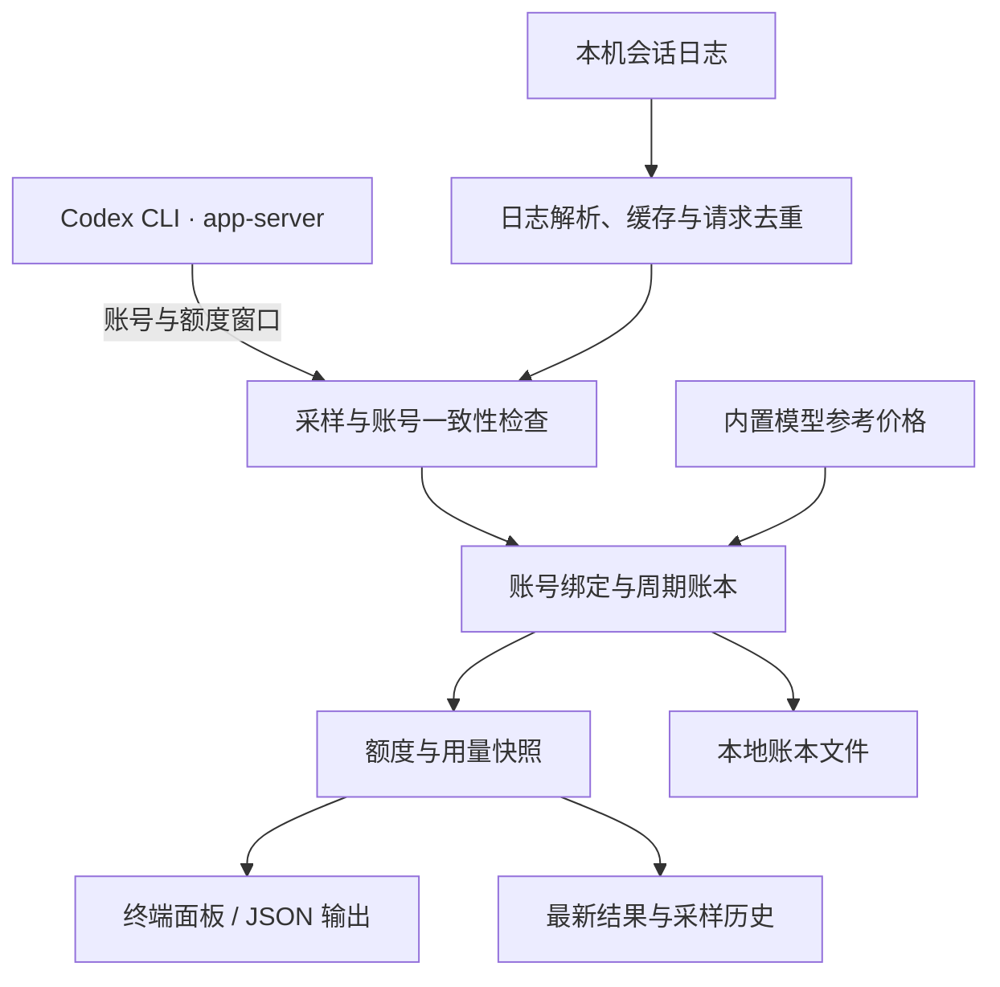

# 工作原理

[返回项目首页](../README.md)

额度查询与本机日志统计分别提供数据，再由周期账本汇总为一份快照。



## 统计口径

- **额度**：通过 Codex CLI 的 `account/read` 和 `account/rateLimits/read` 获取；不同额度桶分别展示，缺失窗口显示「接口未返回」。
- **周期**：以接口给出的窗口时长和重置时间为准。周期起点等于重置时间减去窗口时长，周窗口不按自然周计算。
- **用量**：读取 `CODEX_HOME` 下的 `sessions/` 与 `archived_sessions/`，按请求去重，再归入对应账号和周期。
- **账号归属**：首次识别的账号从首次观测时开始绑定。日志不具备可靠的逐请求账号标识，因此更早的历史不会自动归入新账号。

## 如何理解金额

已用 API 等值来自逐请求模型、Token 分类和已记录的速度档位。价格与长上下文调整规则保存在 [`src/usage-pricing.mjs`](../src/usage-pricing.mjs)，不会自动联网更新；未知模型显示「待定价」，速度档位不明时保留金额范围。

只有在账号历史覆盖当前周期、额度已用比例大于零，且定价与日志等检查通过时，才会进行以下外推：

```text
满额 API 等值 ≈ 本周期已用 API 等值 × 100 ÷ 额度已用百分比
剩余 API 等值 ≈ 满额 API 等值 × 剩余百分比 ÷ 100
```

其他设备的用量、缺失日志、接口上报延迟和模型组合变化都会影响结果。周期内出现额度比例回退、额外 credits 变化或重置券减少时，程序保留本机累计用量，并暂停受影响周期的外推。额外 credits 和重置券独立展示。
